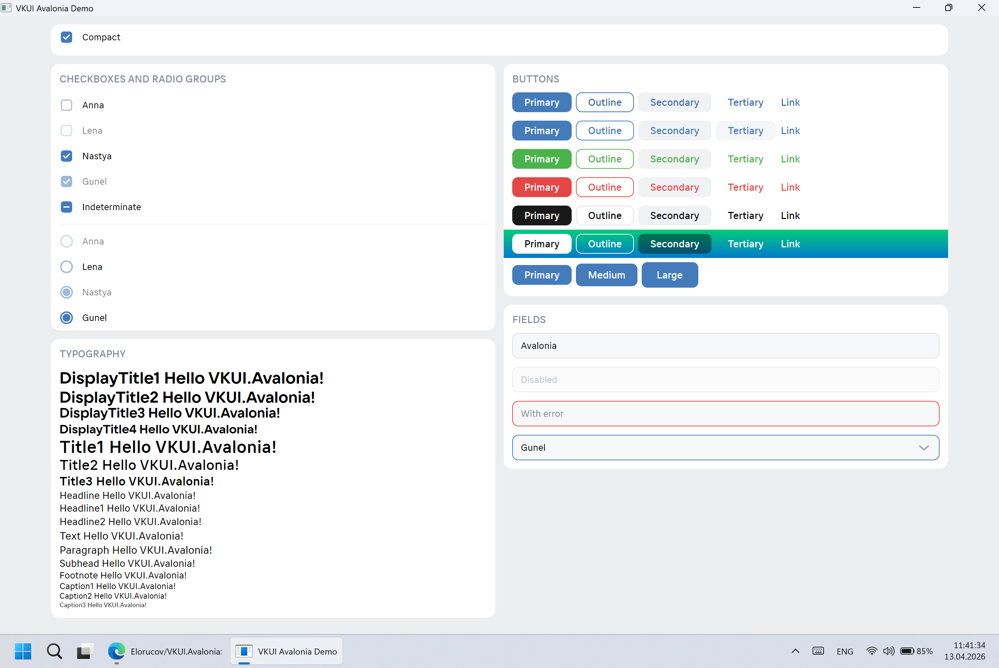

# VKUI.Avalonia

[VKUI](https://vkui.io) design implementation for [Avalonia](https://avaloniaui.net).

<picture align="center">
  <source media="(prefers-color-scheme: dark)" srcset="Screenshots/demo_dark_2026.04.13.webp">
  <source media="(prefers-color-scheme: light)" srcset="Screenshots/demo_light_2026.04.13.webp">
  
</picture>

> [!WARNING]
> Originally, the library was a separate project within [Laney-Avalonia](https://github.com/Elorucov/Laney-Avalonia) and used outdated tokens (colors, sizes, etc.). It was then separated into a standalone independent library and is currently undergoing refactoring.

The library contains styles and components for many controls, however only the following ones are ready:

* Button
* Checkbox
* ComboBox
* RadioButton
* TextBox
